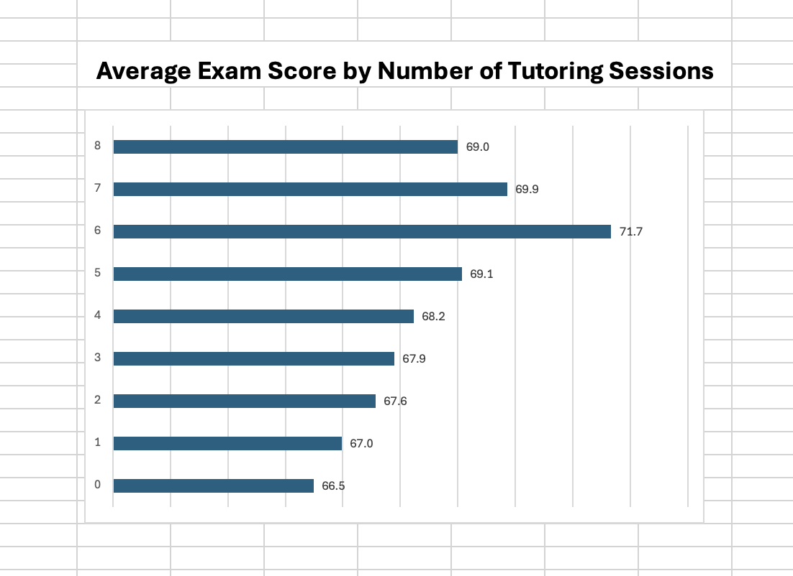
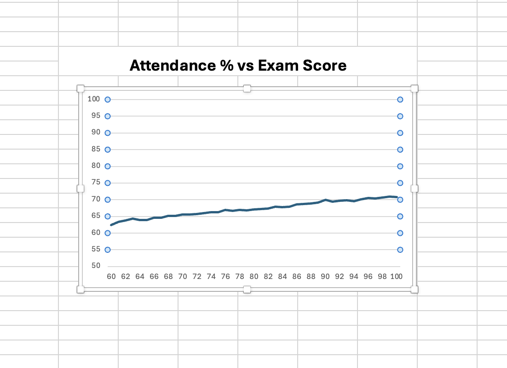

# Student Performance Analysis 📊

## Overview

This project explores factors that may influence student exam performance using spreadsheet analysis techniques.

The dataset was analysed using Excel functions, PivotTables, conditional formatting, and data visualisation techniques to identify trends and patterns within student performance data.

## Objectives

- Analyse student performance data
- Demonstrate spreadsheet analysis skills
- Create meaningful visualisations
- Identify trends affecting exam results

## Skills Demonstrated

- Data Cleaning
- Data Formatting
- Sorting and Filtering
- Conditional Formatting
- PivotTables
- Charts and Graphs
- Data Visualisation
- Excel Functions

## Functions Used

- CONCAT
- COUNTA
- COUNTIF
- SUMIF
- AVERAGEIF

## Analysis Performed

### Data Preparation
- Organised exam scores from highest to lowest
- Formatted numerical columns correctly
- Combined Gender and School Type using CONCAT

### Calculations
- Calculated study productivity by dividing exam scores by study hours

### Conditional Formatting
- Highlighted exam scores of 60 and below

### Statistical Analysis
- Calculated averages and totals for private school students

## Key Visualisations

- Average Exam Score by School Type
- Average Exam Score by Gender
- Study Hours vs Exam Score
- Student Distribution by School Type

## Data Visualisations

### Average Exam Score by Parental Involvement

### Average Exam Score by Tutoring Sessions

### Attendance Percentage vs Exam Score

## Future Improvements

- Perform regression analysis
- Build an interactive dashboard
- Analyse additional performance factors
